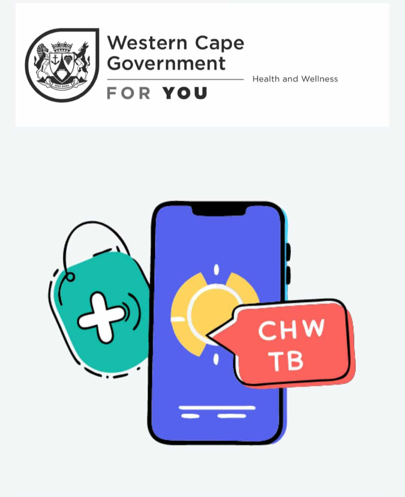

# chw_admin

# Community Health Worker - Admin Panel



## About The Project

This is a Flutter-based admin panel for the Community Health Worker application. It provides administrative functionalities to manage CHWs, patients, facilities, and other related data.

## Features

*   **Dashboard:** View key metrics and statistics.
*   **User Management:** Manage CHWs and other users.
*   **Facility Management:** Add, view, and edit healthcare facilities.
*   **Patient Management:** View and manage patient data.
*   **Audit Logs:** Track changes and activities within the system.
*   **Referrals and Follow-ups:** Manage patient referrals and follow-ups.

## Getting Started

To get a local copy up and running follow these simple steps.

### Prerequisites

*   Flutter SDK: Make sure you have the Flutter SDK installed. You can find the installation guide [here](https://flutter.dev/docs/get-started/install).
*   Firebase Account: This project uses Firebase for backend services. You will need a Firebase project.

### Installation

1.  Clone the repo
    ```sh
    git clone https://github.com/Mahad-Ghauri/Community-Health-Worker--Admin.git
    ```
2.  Install Flutter packages
    ```sh
    flutter pub get
    ```
3.  Set up Firebase for your project. You will need to add your own `google-services.json` file for Android and configure Firebase for iOS and web.

## Dependencies

This project uses several open-source packages:

*   `firebase_core`: For initializing Firebase.
*   `firebase_auth`: For authentication.
*   `cloud_firestore`: For database storage.
*   `provider`: For state management.
*   `go_router`: For navigation.
*   And many more...

For a full list of dependencies, please see the `pubspec.yaml` file.

## Contributing

Contributions are what make the open source community such an amazing place to learn, inspire, and create. Any contributions you make are **greatly appreciated**.

1.  Fork the Project
2.  Create your Feature Branch (`git checkout -b feature/AmazingFeature`)
3.  Commit your Changes (`git commit -m 'Add some AmazingFeature'`)
4.  Push to the Branch (`git push origin feature/AmazingFeature`)
5.  Open a Pull Request

## License

Distributed under the MIT License. See `LICENSE` for more information.
